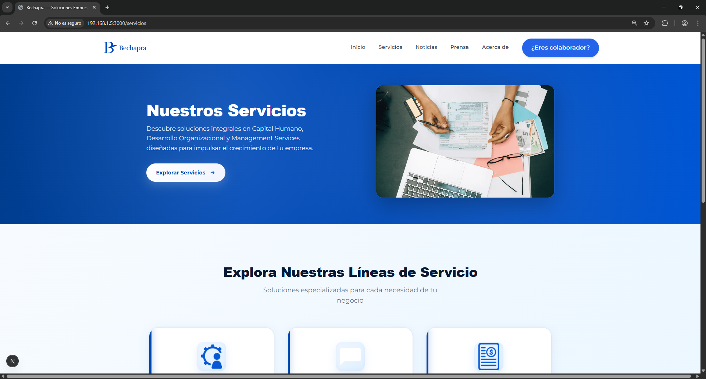
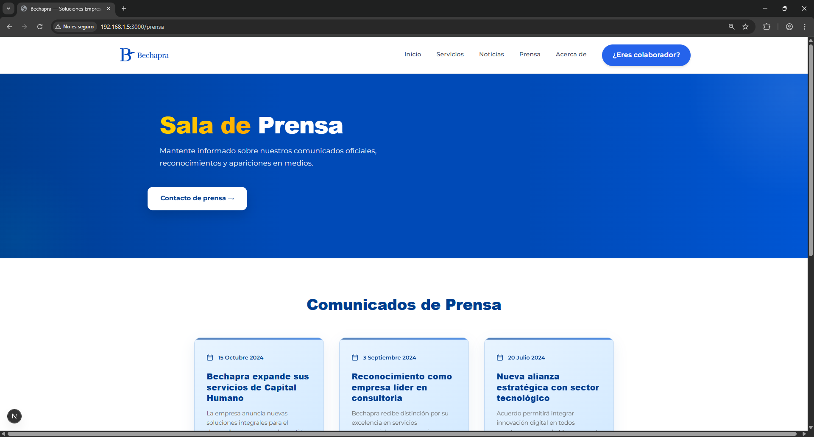

<div align="center">

# 🏢 Bechapra
### Soluciones Empresariales en Contabilidad y Tecnología


[](https://nextjs.org)
[](https://react.dev)
[](https://tailwindcss.com)
[](https://typescriptlang.org)
[](https://framer.com/motion)
[](https://zustand-demo.pmnd.rs)

**Plataforma empresarial de vanguardia que integra servicios contables, fiscales y soluciones tecnológicas**  
*Transformamos la gestión empresarial mediante innovación digital y expertise financiero*

[🌐 Sitio Web](https://bechapra.com) • [📧 Contacto](mailto:automatizacio@bechapra.com.mx) • [📖 Documentación](https://docs.bechapra.com)

</div>

---

## 📋 Tabla de Contenidos

- [Acerca del Proyecto](#-acerca-del-proyecto)
- [Características Principales](#-características-principales)
- [Tecnologías](#️-tecnologías)
- [Instalación](#-instalación)
- [Estructura del Proyecto](#-estructura-del-proyecto)
- [Capturas de Pantalla](#-capturas-de-pantalla)
- [Contribución](#-contribución)
- [Contacto](#-contacto)
- [Licencia](#-licencia)

---

## 🎯 Acerca del Proyecto

**Bechapra** es una plataforma empresarial integral diseñada para organizaciones que buscan excelencia en la gestión contable, cumplimiento fiscal y transformación digital. Nuestra solución combina años de experiencia en servicios financieros con tecnología de punta, ofreciendo:

### 🏆 Nuestra Propuesta de Valor

- **Servicios Contables Especializados**: Contabilidad general, auditoría y consultoría fiscal
- **Transformación Digital**: Automatización de procesos financieros y administrativos
- **Cumplimiento Normativo**: Soluciones actualizadas con la legislación vigente
- **Análisis Financiero**: Reportes inteligentes y dashboards en tiempo real
- **Integración ERP**: Conectividad con sistemas empresariales existentes

---

## ✨ Características Principales

### 🔧 Funcionalidades Empresariales

- **Sistema de Gestión Contable** - Control integral de operaciones financieras
- **Portal de Clientes** - Acceso seguro a documentación y estados de cuenta
- **Calculadoras Fiscales** - Herramientas interactivas para ISR, IVA y nómina
- **Gestión Documental** - Almacenamiento y organización de comprobantes fiscales
- **Reportes Personalizados** - Generación automatizada de informes financieros

### 🎨 Características Técnicas

- ⚡ **Rendimiento Optimizado** - Carga rápida con SSR y optimización de recursos
- 🌍 **Internacionalización (i18n)** - Soporte para múltiples idiomas
- 📱 **Diseño Responsivo** - Experiencia perfecta en todos los dispositivos
- 🔒 **Seguridad Empresarial** - Encriptación y cumplimiento de estándares
- ♿ **Accesibilidad WCAG 2.1** - Interfaz inclusiva y conforme a normativas
- 🚀 **SEO Optimizado** - Posicionamiento mejorado en buscadores
- 🎭 **Animaciones Fluidas** - Interacciones elegantes con Framer Motion

---

## 🛠️ Tecnologías

### Frontend Stack

| Tecnología | Versión | Uso |
|-----------|---------|-----|
| **Next.js** | 16.0.4 | Framework React con SSR/SSG |
| **React** | 19.1.0 | Biblioteca de componentes UI |
| **TypeScript** | 5.0.0 | Tipado estático y seguridad |
| **TailwindCSS** | 4.0.0 | Framework CSS utility-first |
| **Framer Motion** | 12.23.24 | Animaciones y transiciones |
| **Zustand** | 5.0.8 | Gestión de estado global |
| **Lucide Icons** | Latest | Iconografía moderna |


---

## 🚀 Instalación

### Prerequisitos

- Node.js 18.x o superior
- npm 9.x o superior
- Git

### Pasos de Instalación

```bash
# 1. Clonar el repositorio
git clone https://github.com/EduardoPedroza017/PaginaWebBechapra.git
cd PaginaWebBechapra

# 2. Instalar dependencias
npm install

# 3. Configurar variables de entorno
cp .env.example .env.local
# Editar .env.local con tus credenciales

# 4. Ejecutar en modo desarrollo
npm run dev

# La aplicación estará disponible en http://localhost:3000
```

### Compilación para Producción

```bash
# Construir la aplicación
npm run build

# Ejecutar en modo producción
npm start

# Análisis del bundle
npm run analyze
```

---

## 📁 Estructura del Proyecto

```
PaginaWebBechapra/
│
├── app/                    # Rutas y páginas (App Router)
│   ├── (landing)/         # Grupo de rutas públicas
│   ├── (portal)/          # Portal de clientes
│   └── api/               # API endpoints
│
├── components/             # Componentes React reutilizables
│   ├── ui/                # Componentes de interfaz base
│   ├── layout/            # Navbar, Footer, Sidebar
│   ├── sections/          # Secciones de página
│   └── forms/             # Formularios y validaciones
│
├── lib/                    # Utilidades y helpers
│   ├── api/               # Clientes API
│   ├── utils/             # Funciones auxiliares
│   └── constants/         # Constantes y configuración
│
├── public/                 # Recursos estáticos
│   ├── imagen/            # Logotipos e imágenes
│   └── icons/             # Iconos y favicons
│
├── styles/                 # Estilos globales
│   ├── globals.css        # CSS global y Tailwind
│   └── animations.css     # Animaciones personalizadas
│
├── messages/               # Archivos de traducción i18n
│   ├── es.json            # Español
│   └── en.json            # Inglés
│
├── types/                  # Definiciones TypeScript
├── middleware.ts           # Middleware de Next.js
├── next.config.ts          # Configuración Next.js
├── tailwind.config.ts      # Configuración Tailwind
└── tsconfig.json           # Configuración TypeScript
```

---

## 📸 Capturas de Pantalla

<div align="center">

### 🏠 Página de Inicio


*Presentación institucional con acceso rápido a servicios empresariales clave*

---

### 💼 Catálogo de Servicios


*Portafolio completo de soluciones contables, fiscales y tecnológicas*

---

### 🏢 Acerca de Bechapra


*Misión, visión y valores que nos distinguen como líderes en el sector*

---

### 📰 Noticias y Actualizaciones


*Últimas novedades, cambios fiscales y comunicados relevantes*

---

### 📢 Sala de Prensa


*Apariciones mediáticas, entrevistas y menciones en publicaciones especializadas*

</div>

---

## 🤝 Contribución

Las contribuciones son bienvenidas y valoradas. Para contribuir al proyecto:

### Proceso de Contribución

1. **Fork del Repositorio**
   ```bash
   # Crear tu fork en GitHub, luego clonar
   git clone https://github.com/tu-usuario/PaginaWebBechapra.git
   ```

2. **Crear Rama de Desarrollo**
   ```bash
   git checkout -b feature/nueva-funcionalidad
   # o
   git checkout -b fix/correccion-error
   ```

3. **Realizar Cambios**
   ```bash
   # Desarrollar tu funcionalidad o corrección
   git add .
   git commit -m "feat: descripción clara del cambio"
   ```

4. **Push a tu Fork**
   ```bash
   git push origin feature/nueva-funcionalidad
   ```

5. **Abrir Pull Request**
   - Describe detalladamente los cambios realizados
   - Referencia issues relacionados si aplica
   - Incluye capturas de pantalla si hay cambios visuales

### Guías de Estilo

- Seguir convenciones de código establecidas (ESLint/Prettier)
- Escribir mensajes de commit descriptivos (Conventional Commits)
- Documentar funciones y componentes nuevos
- Incluir pruebas cuando sea posible
- Mantener la coherencia con el diseño existente

---

## 📞 Contacto

<div align="center">

**Bechapra - Soluciones Empresariales**

📧 **Email**: [automatizacio@bechapra.com.mx](mailto:automatizacio@bechapra.com.mx)  
🌐 **Website**: [www.bechapra.com](https://bechapra.com)  
📍 **Ubicación**: Ciudad de México, México

---

### Síguenos

[](https://linkedin.com/company/bechapra)
[](https://twitter.com/bechapra)
[](https://facebook.com/bechapra)

</div>

---

## 📄 Licencia

**© 2025 Bechapra. Todos los derechos reservados.**

Este proyecto es propiedad de Bechapra y está protegido por las leyes de derechos de autor aplicables. El uso, reproducción o distribución no autorizada está prohibida.

---

<div align="center">

**Desarrollado con 💼 por el equipo de Bechapra**

*Transformando empresas mediante tecnología y expertise financiero*

[](https://nextjs.org)
[](https://react.dev)

</div>